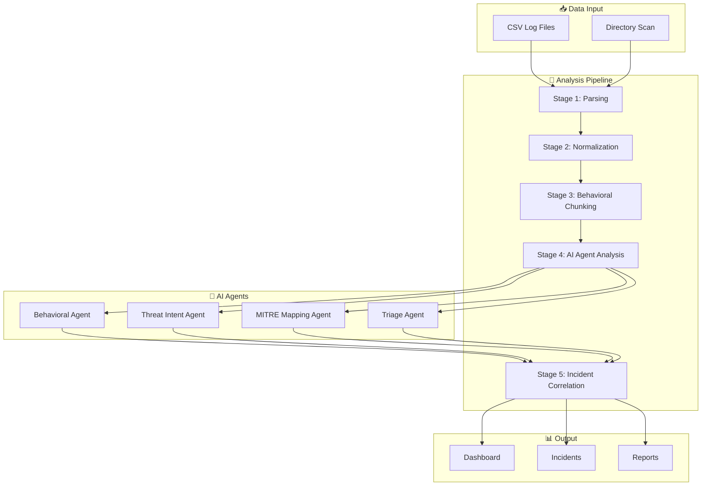
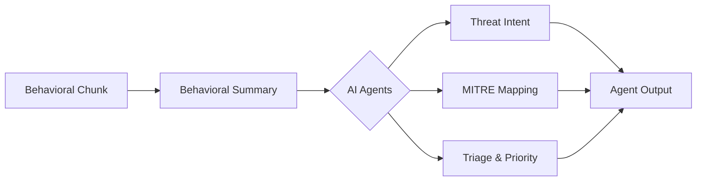

# Cyberdef 1.0 - Technical Architecture Guide

## Executive Summary

Cyberdef 1.0 is an AI-powered network threat analysis platform that transforms raw network logs into actionable security intelligence. The platform uses a multi-stage pipeline combining behavioral analysis, machine learning, and the MITRE ATT&CK framework to detect sophisticated cyber threats.

---

## System Architecture Overview



---

## Stage 1: Data Ingestion & Parsing

### Purpose
Ingest raw CSV log files and extract structured data regardless of vendor format.

### How It Works

1. **File Upload**
   - Files uploaded via REST API (`POST /api/v1/files/upload`)
   - Stored in immutable raw storage with SHA-256 checksums
   - Metadata tracked in SQLite/PostgreSQL database

2. **Parser Detection**
   - `ParserRegistry.detect_parser()` analyzes column headers
   - Matches against known vendor schemas (Palo Alto, Fortinet, etc.)
   - Falls back to generic CSV parser if no match

3. **Event Extraction**
   ```python
   # Each row becomes a RawEventRow
   RawEventRow(
       file_id=UUID,
       row_number=int,  # 1-indexed
       raw_data=dict    # Key-value pairs
   )
   ```

### Supported Formats
| Vendor | Required Columns |
|--------|------------------|
| Generic | timestamp, src_ip, dst_ip |
| Palo Alto | Source Address, Destination Address, Action |
| Fortinet | scrip, dstip, action, service |

### Key Files
- `file_intake/service.py` - File storage and retrieval
- `parser/base.py` - Parser registry and detection
- `parser/generic.py` - Generic CSV parser

---

## Stage 2: Event Normalization

### Purpose
Transform vendor-specific fields into a canonical schema for consistent analysis.

### How It Works

1. **Field Mapping**
   ```python
   NormalizedEvent(
       event_id=UUID,
       timestamp=datetime,
       src_ip="192.168.1.100",     # Validated IPv4/IPv6
       dst_ip="10.0.0.50",
       dst_port=443,
       protocol=NetworkProtocol.TCP,
       action=EventAction.ALLOW,
       bytes_sent=1024,
       bytes_received=2048,
       is_src_internal=True,       # RFC1918 detection
       is_dst_internal=True
   )
   ```

2. **Validation & Cleaning**
   - IP address validation (handles edge cases like "0.0.0.0")
   - Protocol inference from port if not specified
   - Action normalization (allow/deny/drop → standard enum)

3. **Enrichment Fields**
   - Internal/external IP classification
   - Severity scoring
   - GeoIP data (when configured)

### Schema (OCSF-inspired)
```python
class NormalizedEvent:
    # Core fields
    event_id: UUID
    timestamp: datetime
    
    # Network fields
    src_ip: str | None
    dst_ip: str | None
    dst_port: int | None
    protocol: NetworkProtocol
    
    # Action
    action: EventAction
    
    # Extended (when available)
    username: str | None
    hostname: str | None
    http_method: str | None
    user_agent: str | None
    severity: int | None
```

### Key Files
- `normalization/service.py` - Main normalization logic
- `shared_models/events.py` - Event schemas

---

## Stage 3: Behavioral Chunking

### Purpose
Group individual events into behavioral units that represent cohesive activity patterns.

### How It Works

1. **Grouping Strategy**
   Events are grouped by a primary entity, then split into time windows.

   ```python
   # Available strategies
   SrcIPChunkStrategy    # Group by source IP (15-min windows)
   DstHostChunkStrategy  # Group by destination (30-min windows)
   UserChunkStrategy     # Group by username (2-hour windows)
   ```

2. **Time Window Creation**
   ```
   Events for IP 192.168.1.100:
   
   Window 1: 10:00-10:15 → Chunk A (45 events)
   Window 2: 10:15-10:30 → Chunk B (102 events)
   Window 3: 10:30-10:45 → Chunk C (23 events)
   ```

3. **Chunk Structure**
   ```python
   BehavioralChunk(
       chunk_id=UUID,
       file_id=UUID,
       
       # Actor Context
       actor=ActorContext(
           src_ip="192.168.1.100",
           username="jsmith",
           is_internal=True
       ),
       
       # Target Context
       target=TargetContext(
           unique_dst_ips=["10.0.0.1", "10.0.0.2"],
           unique_dst_ports=[80, 443, 8080],
           unique_hostnames=["server1", "server2"]
       ),
       
       # Activity Profile
       activity=ActivityProfile(
           total_events=102,
           total_bytes=1048576,
           allow_count=98,
           deny_count=4,
           protocols=["TCP", "UDP"],
           action_breakdown={"allow": 98, "deny": 4}
       ),
       
       # Temporal Pattern
       temporal=TemporalPattern.BURST  # or STEADY, PERIODIC, etc.
   )
   ```

4. **Suspicious Chunk Filtering**
   Only chunks meeting threat criteria proceed to AI analysis:
   - High denial rates
   - Unusual port scanning
   - Large data transfers
   - Anomalous time patterns

### Compression
Chunking achieves ~95% compression (e.g., 10,000 events → 500 chunks).

### Key Files
- `chunking/service.py` - Chunking orchestration
- `chunking/strategies.py` - Strategy implementations

---

## Stage 4: AI Agent Analysis

### Purpose
Apply specialized AI agents to interpret behavioral patterns and identify threats.

### Agent Pipeline



### AI Agents

#### 1. Behavioral Summary Agent
- **Input**: Raw chunk data
- **Output**: Structured behavioral summary
- **Purpose**: Generate human-readable summary of activity patterns
- **Model**: Llama 3.1 (8B) via Ollama

#### 2. Threat Intent Agent
- **Input**: Behavioral summary
- **Output**: 
  ```json
  {
    "suspected_intent": "Data exfiltration attempt",
    "kill_chain_stage": "Exfiltration",
    "confidence": 0.85,
    "alternative_intents": ["Backup process", "Sync operation"],
    "reasoning": "Large outbound data transfer to external IP..."
  }
  ```
- **Purpose**: Infer attacker objectives and attack lifecycle stage

#### 3. MITRE ATT&CK Mapping Agent
- **Input**: Behavioral summary + intent analysis
- **Output**:
  ```json
  {
    "techniques": [
      {
        "technique_id": "T1041",
        "technique_name": "Exfiltration Over C2 Channel",
        "tactic": "Exfiltration",
        "confidence": 0.82
      }
    ]
  }
  ```
- **Purpose**: Map behaviors to ATT&CK framework for standardized reporting

#### 4. Triage & Narrative Agent
- **Input**: All previous analysis
- **Output**:
  ```json
  {
    "priority": "High",
    "risk_reason": "Suspicious outbound data transfer to known threat IP",
    "recommended_action": "Block destination IP and investigate endpoint",
    "executive_summary": "Potential data breach detected from finance server",
    "technical_summary": "192.168.1.50 transferred 2.3GB to 45.33.32.156...",
    "enrichment_suggestions": ["Threat Intel lookup", "EDR logs"]
  }
  ```
- **Purpose**: Prioritize threats and generate analyst-ready narratives

### Agent Orchestration
- LangGraph manages agent sequencing
- Parallel execution where possible
- Configurable concurrency (default: 2 concurrent analyses)
- Automatic retry on failures

### Key Files
- `agents/orchestrator.py` - LangGraph coordination
- `agents/behavioral_agent.py` - Behavior summarization
- `agents/intent_agent.py` - Intent inference
- `agents/mitre_agent.py` - MITRE mapping
- `agents/triage_agent.py` - Priority and narratives

---

## Stage 5: Incident Correlation

### Purpose
Group related agent outputs into actionable incidents.

### How It Works

1. **Incident Creation**
   ```python
   Incident(
       incident_id=UUID,
       title="Suspected Data Exfiltration from 192.168.1.50",
       priority=IncidentPriority.HIGH,
       status=IncidentStatus.NEW,
       
       # Source tracing
       chunk_ids=[...],
       file_ids=[...],
       
       # Actor info
       primary_actor_ip="192.168.1.50",
       affected_hosts=["finance-server-01"],
       
       # MITRE mapping
       mitre_techniques=[
           MitreReference(
               technique_id="T1041",
               technique_name="Exfiltration Over C2",
               tactic="Exfiltration",
               confidence=0.82
           )
       ],
       
       # Narratives
       executive_summary="...",
       technical_summary="...",
       recommended_actions=[...]
   )
   ```

2. **Priority Levels**
   | Priority | Response Time | Criteria |
   |----------|---------------|----------|
   | Critical | Immediate | Active breach, ransomware |
   | High | < 4 hours | Confirmed malicious activity |
   | Medium | < 24 hours | Suspicious patterns |
   | Low | Best effort | Unusual but likely benign |

3. **Status Workflow**
   ```
   NEW → TRIAGED → INVESTIGATING → CONFIRMED → RESOLVED
                                  ↘ FALSE_POSITIVE
   ```

### Key Files
- `incidents/service.py` - Incident management
- `shared_models/incidents.py` - Incident schemas

---

## Long-Horizon Rollup Analysis

### Purpose
Detect "low-and-slow" attacks that span days or weeks across multiple files.

### How It Works

1. **Actor Profiling**
   Correlate chunks by IP/username across all analyzed files:
   ```python
   ActorProfile(
       primary_ip="203.0.113.50",
       all_ips=["203.0.113.50", "203.0.113.51"],
       first_seen=datetime(2024, 1, 1),
       last_seen=datetime(2024, 1, 15),
       total_events=1500,
       unique_targets=45,
       file_ids={file1_uuid, file2_uuid, file3_uuid}
   )
   ```

2. **Pattern Detection**
   - **Working Hours**: Activity only during business hours
   - **After Hours**: Predominantly off-hours activity
   - **Periodic**: Regular timed intervals (C2 beaconing)
   - **Burst**: Sudden activity spikes

3. **Risk Scoring**
   Factors include:
   - Denial rate
   - Unique target count
   - Sensitive port access
   - Cross-file activity
   - Temporal anomalies

### Key Files
- `rollups/service.py` - Long-horizon analysis

---

## API Reference

### File Management
| Endpoint | Method | Description |
|----------|--------|-------------|
| `/api/v1/files/upload` | POST | Upload CSV file |
| `/api/v1/files/` | GET | List all files |
| `/api/v1/files/{id}` | GET | Get file metadata |
| `/api/v1/analyze?file_id=` | POST | Run analysis pipeline |

### Analysis Results
| Endpoint | Method | Description |
|----------|--------|-------------|
| `/api/v1/agent-outputs/{file_id}` | GET | Get AI agent outputs for a file |
| `/api/v1/rollups` | GET | Long-horizon cross-file correlation |
| `/api/v1/validation` | GET | Reproducibility metrics and cache stats |

### Incident Management
| Endpoint | Method | Description |
|----------|--------|-------------|
| `/api/v1/incidents/` | GET | List incidents |
| `/api/v1/incidents/{id}` | GET | Get incident details |
| `/api/v1/incidents/{id}` | PATCH | Update incident |
| `/api/v1/incidents/stats` | GET | Get statistics |

### Health & System
| Endpoint | Method | Description |
|----------|--------|-------------|
| `/health` | GET | System health check |
| `/docs` | GET | OpenAPI documentation |

---

## Data Flow Summary

```
CSV File (45MB, 500K rows)
    ↓
[Stage 1: Parsing] → 500,000 RawEventRows
    ↓
[Stage 2: Normalization] → 498,500 NormalizedEvents (1,500 errors)
    ↓
[Stage 3: Chunking] → 2,500 BehavioralChunks (95% compression)
    ↓
[Filtering] → 150 SuspiciousChunks
    ↓
[Stage 4: AI Analysis] → 150 AgentOutputs (~5 minutes with Llama 3.1)
    ↓
[Stage 5: Correlation] → 25 Incidents (3 Critical, 8 High, 14 Medium)
```

---

## Performance Characteristics

| Metric | Value |
|--------|-------|
| Parsing speed | ~50,000 rows/second |
| Normalization speed | ~40,000 events/second |
| Chunking compression | 95-99% |
| AI analysis time | ~2s per chunk (Llama 3.1 8B) |
| End-to-end (45MB file) | ~15 minutes |

---

## Technology Stack

| Component | Technology |
|-----------|------------|
| Backend Framework | FastAPI (Python 3.11+) |
| AI Model | Llama 3.1 8B via Ollama |
| Agent Orchestration | LangGraph |
| Database | SQLite (dev) / PostgreSQL (prod) |
| Frontend | React + TypeScript + Vite |
| Charting | Recharts |
| Icons | Lucide React |

